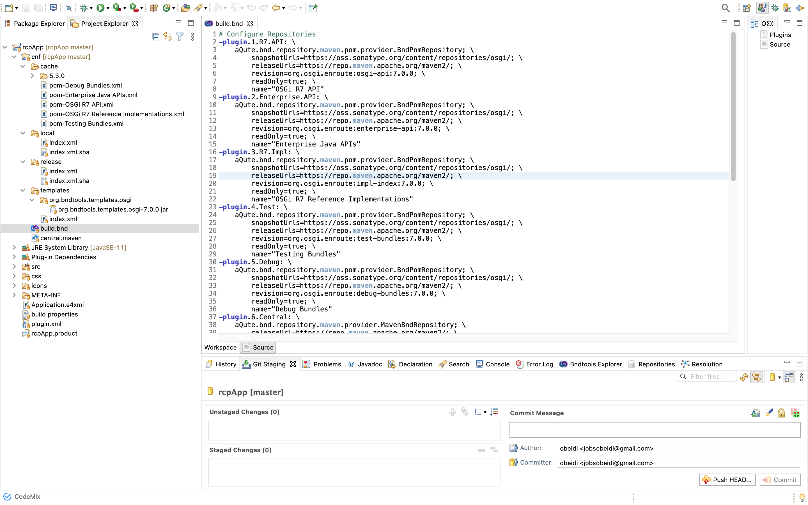

# poc_rcpPlugin_bndtools
Die Umsetzung ist an den GitHub Repo : https://github.com/peterkir/example.bnd.rcp.git angelehnt.

## How to run:
 1. open the Shell and go to the Folder you want to clone the Repo.
 2. git clone https://github.com/obeidi/poc_rcpPlugin_bndtools.git
 3. open Eclipse and import the cloned Repo as "Existing Projects into Workspace" 
 4. go to the master-Branch.
 5. open the Project an go to rcpPlugin2 and open the .bndrun File.  
    For mac: app.ui_macosx.cocoa.x86-64.bndrun and  
	for windows: app.ui_win32.win32.x86-64.bndrun
 6. start the .bndrun with the play-Button. 
 
 ## to implement bndtools in a Eclipse RCP Application 
 1. create a BND-Workspace in your RCP:
	new->other->Bndtools->"Bnd OSGI Workspace" -> click next.  
	navigate to your RCP-Workarea.  
	choose the workspace 5.3 (we use it hier)  
	create your BND-Workspace
    
 2. create a Folder "rcp-app" next to cnf. 
 3. create in the Folder "rcp-app" an Eclipse RCP. (https://www.vogella.com/tutorials/EclipseRCP/article.html)
 4. 