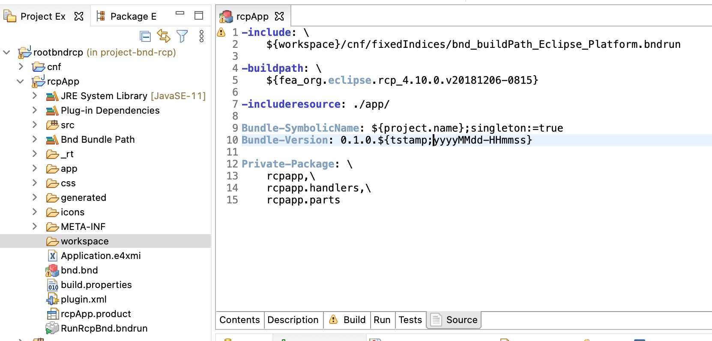
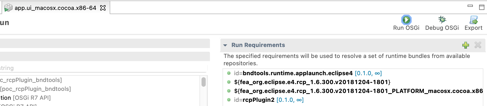

# poc_rcpPlugin_bndtools
Die Umsetzung ist an den GitHub Repo : https://github.com/peterkir/example.bnd.rcp.git angelehnt.

## How to run:
 1. open the Shell and go to the Folder you want to clone the Repo.
 2. git clone https://github.com/obeidi/poc_rcpPlugin_bndtools.git
 3. open Eclipse and import the cloned Repo as "Existing Projects into Workspace" 
 4. go to the master-Branch.
 5. open the Project an go to rcpPlugin2 and open the .bndrun File.  
    For mac: app.ui_macosx.cocoa.x86-64.bndrun and  
	for windows: app.ui_win32.win32.x86-64.bndrun
 6. start the .bndrun with the play-Button. 
 
 ## to implement bndtools in a Eclipse RCP Application 
 1. install bndtools above Eclipse Marketplace.
 2. create a Folder and call it "root", this is your root-folder.
 3. create in root a simple Java-Project.
 4. create a BND-Workspace in the root:
	File->new->other->Bndtools->"Bnd OSGI Workspace" -> click next.  
	navigate to your RCP-Workarea.  
	choose the workspace 5.3 (we use it hier)  
	create your BND-Workspace
    
 5. copy the follow Code to build.bnd in cnf:
 [build.bnd](./cnf/build.bnd "build.bnd") 
 
 6. create a folder in /cnf the folder "fixedIndices".
 
 7. copy in /fixedIndices the follow files:
  [bnd_buildpath_Eclipse_Platform.bndrun](./cnf/fixedIndices/bnd_buildpath_Eclipse_Platform.bndrun "bnd_buildpath_Eclipse_Platform.bndrun")    
    [bnd_runrequires_Eclipse_Platform.bndrun](./cnf/fixedIndices/bnd_runrequires_Eclipse_Platform.bndrun "bnd_runrequires_Eclipse_Platform.bndrun") 
 8. copy in /local the Jar:   bndtools.runtime.applaunch.eclipse4-0.1.0.jar
 9. create a Folder "/rcpPlugin2" next to /cnf. 
 10. create in the Folder "/rcpPlugin2" an Eclipse RCP with the same Name!!!! (https://www.vogella.com/tutorials/EclipseRCP/article.html)
     
 11. add a "app" and "workspace" Folder in the RCP Application in the Folder "/rcpPlugin2".
 12. add BND-Nature to the RCP-Project that you build in "/rcpPlugin2"
     
    add the follow code in your bnd.bnd:
    
	[click hier for the code bnd.bnd](./rcpPlugin2/bnd.bnd "bnd.bnd") 
 13. go in the Shell to the root and build with gradle, "gradle build".
 14. create a BNDtools "Run Descriptor File (.bndrun)".  
	 select the Folder rcpApp.  
     File->new->other->Bndtools->"Run Descriptor File (.bndrun)" click next.  
	 select the Empty one  
	 select rcpApp and give the File a Name.
 15. copy the follow code in Run Descriptor:  
    for mac : [app.ui_macosx.cocoa.x86-64.bndrun](./rcpPlugin2/app.ui_macosx.cocoa.x86-64.bndrun "app.ui_macosx.cocoa.x86-64.bndrun")  
    for windows: [app.ui_win32.win32.x86-64.bndrun](./rcpPlugin2/app.ui_win32.win32.x86-64.bndrun "app.ui_win32.win32.x86-64.bndrun")   
 16. build with gradle one more time 
 17. go to app.ui_macosx.cocoa.x86-64.bndrun 
  and click on the play Button.  
   